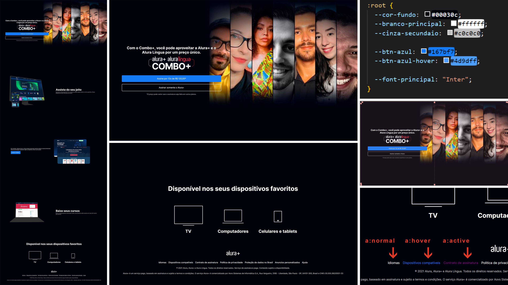

[**ALURA PLUS**](https://rodrigozandeoliveira.github.io/alura_plus/)

##

**ABOUT ALURA PLUS**

- The "Alura Plus" landing page was an exercise of the course "A partir do zero: HTML e CSS para projetos web" from Alura;
- The goal was to practice the basics of the HTML & CSS;
- We received a Figma file of the design of the landing page where we extracted all the details of the project;

##

**OBERVATIONS**

- I learned how to use "variables" to make the css code easy to edit/customize;
- We used Grid & Flexbox to position the elements throughout the page;
- [About Alura](https://www.alura.com.br);
